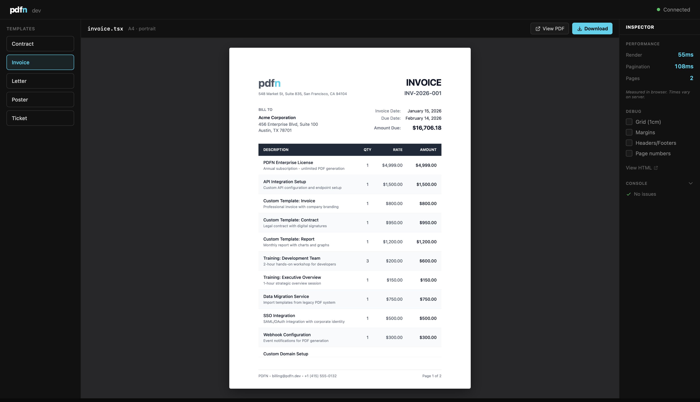

# pdfn

### Write PDF templates as React components. 
**React-first, Chromium-based PDF generation with predictable pagination and Tailwind support.**

---

### How it works

```
React → pdfn → HTML (+ Layout Helpers) → Chromium (Wait for Ready) → PDF
```

1. **React** — Your components render to HTML with page break hints
2. **pdfn** — Injects layout helpers for pagination, headers, footers
3. **Chromium** — Waits for `PDFN.ready`, then captures the PDF

## What pdfn is not

- Not a visual PDF editor
- Not client-side / browser-only

pdfn is a server-side orchestration layer that makes Chromium-based PDF generation predictable and paginated using React.

## Quick Start

In your React project (Next.js, Vite, etc.):

```bash
npm i @pdfn/react         # React components
npx pdfn add invoice      # Add a starter invoice template
npx pdfn dev --open       # Start dev server and open browser
```

Opens a preview UI with a working invoice template. Edit `pdfn-templates/invoice.tsx` and see changes instantly.



## Core Components

These four primitives handle 90% of use cases:

| Component | Purpose |
|-----------|---------|
| `<Document>` | Root wrapper — sets PDF metadata (title, author, fonts) |
| `<Page>` | Page container — defines size, margins, headers, footers |
| `<PageNumber>` | Renders current page number (use in headers/footers) |
| `<PageBreak>` | Forces content to next page |

See the [full component reference](#components) for `<AvoidBreak>`, `<TotalPages>`, table components, and more.

## Requirements

**Server and Edge runtimes only** — not browser/client-side.

- `@pdfn/react` runs in Node.js and Edge runtimes
- Chromium-based PDF rendering runs in a separate `pdfn serve` process (Node/Docker only)

Does not work in:
- Browser JavaScript, SPAs, client-side bundles

> `render()` uses `react-dom/server` to generate HTML, which isn't available in browsers. While this HTML can technically be printed client-side, pdfn does not support or guarantee client-side PDF generation due to browser and environment differences.

## Usage

There are two ways to use pdfn, depending on how much control you want:

- **`render()`** → returns print-ready HTML  
  Use this with Puppeteer, Playwright, Browserless, or any Chromium setup.

- **`generate()`** → returns a PDF buffer directly  
  Uses the local pdfn server to render and print the document.

> **Important:** `generate()` requires a running **local** pdfn server.
> Start one with:
>
> ```bash
> # Start the local PDF server
> npx pdfn serve
>
> # Your app calls generate() → pdfn renders + prints via Chromium
> ```
>
> For development with live preview, use:
>
> ```bash
> npx pdfn dev
> ```

### Basic Example

```tsx
import { Document, Page, PageNumber, generate } from '@pdfn/react';

// Define your PDF template as a React component
function Invoice({ data }: { data: { id: string; customer: string; total: number } }) {
  return (
    <Document title={`Invoice ${data.id}`}>
      <Page
        size="A4"
        margin="1in"
        footer={<PageNumber />}  // Shows "1", "2", etc. on each page
      >
        <h1 style={{ fontSize: 24, marginBottom: 16 }}>Invoice #{data.id}</h1>
        <p style={{ color: '#666' }}>Customer: {data.customer}</p>
        <p style={{ fontSize: 20, fontWeight: 'bold' }}>Total: ${data.total}</p>
      </Page>
    </Document>
  );
}

// Generate the PDF
const pdf = await generate(<Invoice data={{ id: 'INV-001', customer: 'Acme Corp', total: 148 }} />);

// Save to file
import { writeFileSync } from 'fs';
writeFileSync('invoice.pdf', pdf);
```

### Advanced: Using render() with Puppeteer

```tsx
import puppeteer from 'puppeteer';
import { Document, Page, PageNumber, render } from '@pdfn/react';

// Define your PDF template
function Invoice({ data }: { data: { id: string; customer: string; total: number } }) {
  return (
    <Document title={`Invoice ${data.id}`}>
      <Page size="A4" margin="1in" footer={<PageNumber />}>
        <h1 style={{ fontSize: 24, marginBottom: 16 }}>Invoice #{data.id}</h1>
        <p style={{ color: '#666' }}>Customer: {data.customer}</p>
        <p style={{ fontSize: 20, fontWeight: 'bold' }}>Total: ${data.total}</p>
      </Page>
    </Document>
  );
}

// Render React to HTML
const html = await render(<Invoice data={{ id: 'INV-001', customer: 'Acme Corp', total: 148 }} />);

// Launch browser and create PDF
const browser = await puppeteer.launch();
const page = await browser.newPage();

// Load HTML and wait for assets
await page.setContent(html, { waitUntil: 'networkidle0' });

// Wait for pdfn's pagination to complete
// PDFN.ready is set when Chromium layout + pagination stabilizes
await page.waitForFunction(() => (window as any).PDFN?.ready === true);

// Generate PDF with CSS page size support
const pdf = await page.pdf({
  preferCSSPageSize: true,  // Use size from <Page> component
  printBackground: true,    // Include background colors/images
});

await browser.close();

// Save to file
import { writeFileSync } from 'fs';
writeFileSync('invoice.pdf', pdf);
```

> **Why `PDFN.ready`?** This is what makes pdfn different from raw HTML-to-PDF. It waits for layout to stabilize — page breaks are calculated, headers/footers are positioned, and `<PageNumber>` components resolve to actual numbers. Without this, you'd capture a half-rendered document.

### With Tailwind CSS

```tsx
import { Document, Page, PageNumber, generate } from '@pdfn/react';
import { Tailwind } from '@pdfn/tailwind';

// Wrap your content with <Tailwind> to enable class-based styling
function Invoice({ data }: { data: { id: string; customer: string; total: number } }) {
  return (
    <Document title={`Invoice ${data.id}`}>
      <Tailwind>
        <Page size="A4" margin="1in" footer={<PageNumber />}>
          <h1 className="text-2xl font-bold mb-4">Invoice #{data.id}</h1>
          <p className="text-gray-600">Customer: {data.customer}</p>
          <p className="text-xl font-bold">Total: ${data.total}</p>
        </Page>
      </Tailwind>
    </Document>
  );
}

// Generate the PDF
const pdf = await generate(<Invoice data={{ id: 'INV-001', customer: 'Acme Corp', total: 148 }} />);
```

**Which packages do I need?**

| Use Case | Packages |
|----------|----------|
| Basic | `@pdfn/react` |
| With Tailwind CSS | + `@pdfn/tailwind` |
| Client components or Edge runtime | + `@pdfn/next` or `@pdfn/vite` |

**Most users need `@pdfn/react` + `@pdfn/tailwind` + `pdfn`.** Build plugins (`@pdfn/next`/`@pdfn/vite`) are needed for client components (charts) or edge runtimes.

> **Note:** `pdfn dev` includes everything automatically — charts and Tailwind work out of the box.

### Next.js API Route

```tsx
// app/api/invoice/route.ts
import { Document, Page, PageNumber, generate } from '@pdfn/react';
import { Tailwind } from '@pdfn/tailwind';

// Define template as a separate component
function Invoice({ data }: { data: { id: string; customer: string; total: number } }) {
  return (
    <Document title={`Invoice ${data.id}`}>
      <Tailwind>
        <Page size="A4" margin="1in" footer={<PageNumber />}>
          <h1 className="text-2xl font-bold mb-4">Invoice #{data.id}</h1>
          <p className="text-gray-600">Customer: {data.customer}</p>
          <p className="text-xl font-bold">Total: ${data.total}</p>
        </Page>
      </Tailwind>
    </Document>
  );
}

// API route handler
export async function POST(req: Request) {
  const data = await req.json();

  // Generate PDF from the template
  const pdf = await generate(<Invoice data={data} />);

  // Return as downloadable PDF
  return new Response(pdf, {
    headers: {
      'Content-Type': 'application/pdf',
      'Content-Disposition': `attachment; filename="invoice-${data.id}.pdf"`,
    },
  });
}
```

### Node.js (Plain)

pdfn works in any Node.js project — no framework required. Just install the peer dependencies:

```bash
npm i react react-dom @pdfn/react
```

```ts
// generate-invoice.ts
import { Document, Page, PageNumber, generate } from '@pdfn/react';
import { writeFileSync } from 'fs';

function Invoice() {
  return (
    <Document title="Invoice #001">
      <Page size="A4" margin="1in" footer={<PageNumber />}>
        <h1 style={{ fontSize: 24 }}>Invoice #001</h1>
        <p>Total: $148.00</p>
      </Page>
    </Document>
  );
}

const pdf = await generate(<Invoice />);
writeFileSync('invoice.pdf', pdf);
```

Run with `npx tsx generate-invoice.ts` (requires `npx pdfn serve` running).

## Features

### @pdfn/react (Library)

- Standard page sizes (A4, Letter, etc.) + custom dimensions
- Layout with clean page breaks, headers, footers, and watermarks
- Local and web fonts/images auto-embedded
- Custom CSS via `css` prop
- Tailwind CSS support via `@pdfn/tailwind`

### pdfn (CLI)

- Dev server with live preview and hot reload
- Starter templates (invoice, letter, contract, ticket, poster, report)
- Debug overlays for grid, margins, and headers (also available via `render()` and `generate()` options)

## Components

| Component | Key Props | Description |
|-----------|-----------|-------------|
| `<Document>` | `title`, `author`, `fonts`, `css` | Root wrapper with PDF metadata and custom CSS |
| `<Page>` | `size`, `margin`, `header`, `footer` | Page container with layout options |
| `<PageNumber>` | — | Current page number |
| `<TotalPages>` | — | Total page count |
| `<PageBreak>` | — | Force a page break |
| `<AvoidBreak>` | — | Keep content together on same page |
| `<Thead>` | **`repeat`** | Repeats table header on every page |
| `<Tr>` | `keep` | Prevents row from splitting across pages |
| `<Tailwind>` | — | Enable Tailwind classes (from `@pdfn/tailwind`) |

## Packages

| Package | Description | When to use |
|---------|-------------|-------------|
| [@pdfn/react](./packages/react) | React components, `render()`, `generate()` | Always |
| [pdfn](./packages/cli) | CLI dev server and production server | Dev preview + `generate()` |
| [@pdfn/tailwind](./packages/tailwind) | Tailwind CSS support | Want Tailwind styling |
| [@pdfn/next](./packages/next) | Next.js build plugin | Client components or Edge runtime |
| [@pdfn/vite](./packages/vite) | Vite build plugin | Client components or Edge runtime |
| [@pdfn/client](./packages/client) | `"use client"` component bundling (internal) | Used by build plugins |
| [@pdfn/core](./packages/core) | Shared utilities (internal) | Used by other packages |

**Progressive install:** Start with `@pdfn/react` + `pdfn`. Add `@pdfn/tailwind` for styling. Add build plugins for client components or edge runtimes.

## CLI

### `pdfn dev`

Development server with live preview.

```bash
npx pdfn dev                    # Start on port 3456
npx pdfn dev --open             # Start and open browser
npx pdfn dev --port 4000        # Custom port
```

### `pdfn serve`

Production server (headless).

```bash
npx pdfn serve                          # Start server
npx pdfn serve --port 3456              # Custom port
npx pdfn serve --max-concurrent 10      # Concurrency limit
```

### `pdfn add`

Add starter templates.

```bash
npx pdfn add invoice            # Add invoice template (inline styles)
npx pdfn add invoice --tailwind # Add with Tailwind classes
npx pdfn add letter             # Add business letter
npx pdfn add contract           # Add contract template
npx pdfn add ticket             # Add event ticket
npx pdfn add poster             # Add poster template
npx pdfn add report             # Add report with charts (requires @pdfn/next)
npx pdfn add --list             # Show all templates
```

| Option | Description |
|--------|-------------|
| `--inline` | Use inline styles (default) |
| `--tailwind` | Use Tailwind CSS classes (requires `@pdfn/tailwind`) |
| `--force` | Overwrite existing files |

## Is pdfn Right for You?

**Requires Chromium** — PDF generation uses headless Chrome.

### Alternatives

- **[@react-pdf/renderer](https://react-pdf.org)** — Client-side, but limited layout
- **[PDFKit](http://pdfkit.org)** — Fast and low-level, but manual positioning
- **[pdf-lib](https://pdf-lib.js.org)** — Great for modifying existing PDFs, not generating from scratch

**pdfn** gives you full CSS layout with React components.

## Roadmap

**Layout & Pagination**
- [ ] Table primitives — Column definitions, row keep-together, auto sizing
- [ ] Orphans & widows — Prevent single lines at page boundaries

**Document Features**
- [ ] Table of Contents — Auto-generated with page number resolution
- [ ] Internal anchors — Cross-page references ("See page X")
- [ ] Footnotes — Page-local references for legal/academic docs

**Optimization & Compliance**
- [ ] Font subsetting — Smaller PDFs by stripping unused glyphs
- [ ] Image optimization — Auto-compress before embedding
- [ ] PDF/A support — Archival compliance

## Contributing

```bash
pnpm install    # Install dependencies
pnpm build      # Build all packages
pnpm test       # Run tests
pnpm dev        # Watch mode
```

## License

MIT

---

If pdfn saves you time, consider [starring it on GitHub](https://github.com/pdfnjs/pdfn).
