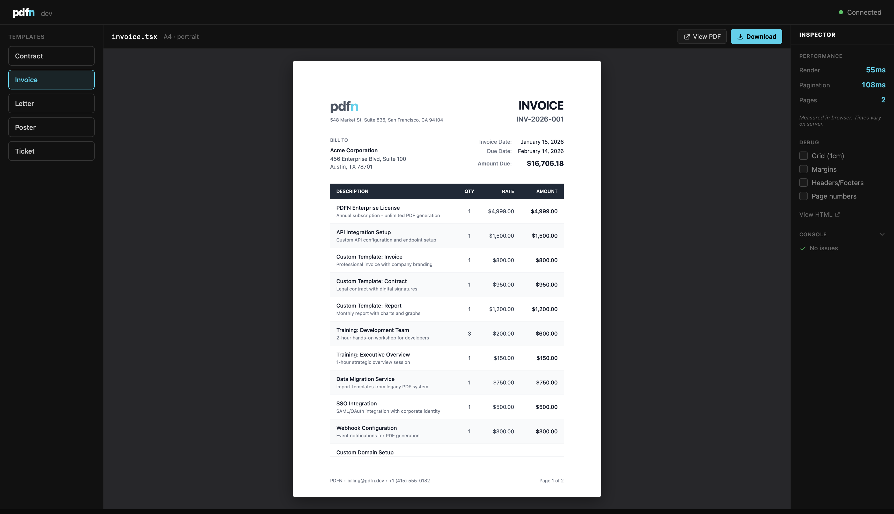

# pdfn

[](https://github.com/pdfnjs/pdfn/actions/workflows/ci.yml)
[](https://www.npmjs.com/package/@pdfn/react)
[](https://www.npmjs.com/package/@pdfn/react)
[](https://github.com/pdfnjs/pdfn/blob/main/LICENSE)

### Write PDF templates as React components.

**React-first, Chromium-based PDF generation with predictable pagination and Tailwind support.**

**[Live Demo](https://pdfn.dev/#preview)** · **[Templates](https://pdfn.dev/templates)** · **[Free PDF Validator](https://pdfn.dev/tools/pdf-validator)**

**Contents:** [Why pdfn](#why-pdfn) · [Who it's for](#who-pdfn-is-for) · [Quick Start](#quick-start) · [Production paths](#choose-your-production-path) · [Examples](#examples) · [Components](#core-components)

## Why pdfn?

Most PDFs start as HTML. As documents grow, minor CSS changes start breaking pagination, headers/footers drift, and preview no longer matches production — causing silent layout failures in business-critical PDFs.

pdfn fixes this:

- **Write PDF templates in React** — components, props, loops, conditionals
- **Live preview** — `npx pdfn dev` with hot reload
- **Smart page breaks** — content never splits mid-paragraph or mid-row
- **Repeating headers/footers** — like Word or Google Docs
- **Dynamic page numbers** — `Page 1 of 5` resolves correctly
- **Debug overlays** — visualize margins, grid, page breaks
- **Tailwind CSS support** — works out of the box via `@pdfn/tailwind`
- **Production PDFs** — self-host with Puppeteer, or use pdfn Cloud

```
React → pdfn → HTML → Chromium → PDF
```

## Who pdfn is for

- Teams generating quotes, contracts, reports, or invoices
- PDFs that grow beyond a few static templates
- Cases where preview must match production exactly

**pdfn is a good fit if:**
- You already rely on HTML/CSS for PDFs
- You've debugged broken page breaks at least once
- You care more about correctness than visual editors

If you only need a one-off PDF or visual export, simpler tools may be enough.

## What pdfn is not

- Not a visual/WYSIWYG PDF editor
- Not client-side PDF generation
- Not a replacement for Chromium

## Why not react-pdf, pdf-lib, or jsPDF?

These libraries work well for simple or fixed-layout PDFs.

Teams usually run into limits when:
- Content flows across pages
- Tables and headers need to repeat reliably
- Layout must match production exactly
- PDFs move server-side or into background jobs
- Archival or accessibility compliance (PDF/A, PDF/UA) becomes a requirement

pdfn doesn't replace HTML-to-PDF or Chromium — it builds on top of it, adding structure, predictability, and optional compliance without introducing a new document DSL.

## Quick Start

pdfn works with any Node.js or Next.js project. Below is a minimal setup to try it locally.

```bash
mkdir pdfn-node && cd pdfn-node
npm init -y
npm install react react-dom @pdfn/react
npx pdfn add invoice
npx pdfn dev --open
```



```tsx
// pdfn-templates/invoice.tsx — created by `pdfn add invoice`
import { Document, Page, PageNumber } from '@pdfn/react';

export default function Invoice({ number, customer, items, ... }) {
  return (
    <Document title={`Invoice ${number}`}>
      <Page size="A4" margin="1in" footer={<PageNumber />}>
        {/* ... */}
      </Page>
    </Document>
  );
}
```

Edit `pdfn-templates/invoice.tsx` — changes appear instantly with hot reload.

### Choose your production path

- **Want full control / already running Puppeteer?** → Self-host with `render()`
- **Want zero browser infra?** → pdfn Cloud with `generate()`

Both produce identical PDFs — same templates, same output.

### API summary

| Function | Returns | Use when |
|----------|---------|----------|
| `render()` | HTML string | Self-hosting with your own Chromium |
| `generate()` | PDF buffer | Using local dev server or pdfn Cloud |

pdfn decides where to run based on environment:
- `PDFN_HOST` set → uses local dev server
- `PDFN_API_KEY` set → uses pdfn Cloud

### What is pdfn Cloud?

pdfn Cloud is a managed PDF runtime that:
- Runs Chromium reliably at scale
- Handles timeouts, crashes, and retries
- Adds optional PDF/A and PDF/UA compliance

It uses the **same templates and layout engine** as local and self-hosted runs — no vendor lock-in.

### Layout vs Archival Compliance

pdfn is fully self-hostable for rendering and layout.

PDF/A and PDF/UA compliance require additional post-processing (validation, metadata normalization, color profiles, font embedding), which is provided by pdfn Cloud.

| Concern | What it means | Where it runs |
|---------|---------------|---------------|
| **Layout** | Pagination, fonts, images, styling | Everywhere (dev, Cloud, self-host) |
| **Archival compliance** | PDF/A validation, metadata, color profiles | pdfn Cloud only |

**Layout output is identical in all cases.** Compliance does not change rendering — it only finalizes the PDF for archival or accessibility requirements.

```tsx
// Works everywhere (self-hosted or Cloud)
const pdf = await generate(<Invoice />);

// Requires pdfn Cloud (post-processing only)
const pdf = await generate(<Invoice />, { standard: 'PDF/A-2b' });
```

**Option 1: Self-host with Puppeteer** — full control, no API key needed

```bash
npm install puppeteer
```

```tsx
// generate-puppeteer-pdf.tsx
import React from 'react';
import { render } from '@pdfn/react';
import { writeFileSync } from 'fs';
import Invoice from './pdfn-templates/invoice';
import puppeteer from 'puppeteer';

async function main() {
  const html = await render(<Invoice number="INV-2025-042" />);

  const browser = await puppeteer.launch();
  const page = await browser.newPage();
  await page.setContent(html, { waitUntil: 'networkidle0' });
  await page.waitForFunction(() => window.PDFN?.ready === true); // Wait for pagination
  const pdf = await page.pdf({ preferCSSPageSize: true, printBackground: true });
  await browser.close();

  writeFileSync('invoice-puppeteer.pdf', pdf);
}
main();
```

```bash
npx tsx generate-puppeteer-pdf.tsx  # Generates invoice-puppeteer.pdf
```

**Option 2: Local dev server** — use `generate()` with local server

```bash
# Terminal 1: Start dev server
npx pdfn dev

# Terminal 2: Generate PDF
PDFN_HOST=http://localhost:3456 npx tsx generate-pdf.tsx
```

```tsx
// generate-pdf.tsx
import React from 'react';
import { generate } from '@pdfn/react';
import { writeFileSync } from 'fs';
import Invoice from './pdfn-templates/invoice';

async function main() {
  // PDFN_HOST points to local server, or PDFN_API_KEY for pdfn Cloud
  const pdf = await generate(<Invoice number="INV-2025-042" />);
  writeFileSync('invoice.pdf', pdf);
}
main();
```

**Option 3: pdfn Cloud** — managed infrastructure, no browser setup

```bash
PDFN_API_KEY=pdfn_live_... npx tsx generate-pdf.tsx
```

Get an API key at [console.pdfn.dev](https://console.pdfn.dev).

## Example: Next.js + Tailwind

```bash
npx create-next-app@latest pdfn-next --tailwind --yes
cd pdfn-next
npm install @pdfn/react @pdfn/tailwind @pdfn/next
```

```ts
// next.config.ts
import type { NextConfig } from 'next';
import { withPdfn } from '@pdfn/next';

const nextConfig: NextConfig = {
  // your existing config
};

export default withPdfn()(nextConfig);
```

```bash
npx pdfn add invoice --tailwind
npx pdfn dev --open  # Preview at http://localhost:3456
```

Create the API route at `app/api/invoice/route.tsx`:

```tsx
// app/api/invoice/route.tsx
import { generate } from '@pdfn/react';
import Invoice from '@/pdfn-templates/invoice';

export async function GET() {
  const pdf = await generate(<Invoice number="INV-2025-042" />);
  return new Response(new Uint8Array(pdf), { headers: { 'Content-Type': 'application/pdf' } });
}
```

```bash
npm run dev  # Start Next.js at http://localhost:3000
```

Open http://localhost:3000/api/invoice to download the PDF.

> **Note:** This example uses `generate()` which requires either `PDFN_HOST` (local server) or `PDFN_API_KEY` (pdfn Cloud). Alternatively, use `render()` + Puppeteer for self-hosting.

## Examples

Full working examples at [github.com/pdfnjs/pdf-examples](https://github.com/pdfnjs/pdf-examples):
- [Node.js](https://github.com/pdfnjs/pdf-examples/tree/main/examples/pdfn-node)
- [Next.js](https://github.com/pdfnjs/pdf-examples/tree/main/examples/pdfn-next)

## Free Tools

### [PDF Validator](https://pdfn.dev/tools/pdf-validator)

Validate PDF/A archival and PDF/UA accessibility compliance. Free, instant validation — no registration required.

- **PDF/A** — Archival compliance (1a/1b, 2a/2b/2u, 3a/3b, 4)
- **PDF/UA** — Accessibility compliance (UA-1, UA-2)

## Core Components

| Component | Purpose |
|-----------|---------|
| `<Document>` | Root wrapper (title, fonts, metadata) |
| `<Page>` | Page container (size, margins, header/footer) |
| `<PageNumber>` | Current page number |
| `<TotalPages>` | Total page count |
| `<PageBreak>` | Force page break |
| `<AvoidBreak>` | Keep content together |
| `<Thead>` | Repeating table header across pages |
| `<Tr>` | Keep table row together |
| `<Tailwind>` | Enable Tailwind classes (from `@pdfn/tailwind`) |

## CLI

```bash
npx pdfn dev              # Dev server with hot reload
npx pdfn dev --open       # Dev server + open browser
npx pdfn add invoice      # Add invoice template
npx pdfn add --list       # See all available templates
```

## Packages

| Use Case | Install |
|----------|---------|
| Basic | `@pdfn/react` |
| + Tailwind CSS | + `@pdfn/tailwind` |
| + Next.js (client components/edge) | + `@pdfn/next` |
| + Vite (client components/edge) | + `@pdfn/vite` |

**Most users:** `npm install @pdfn/react @pdfn/tailwind` + `npx pdfn dev`

## Requirements

- **Node.js 18+** (server-side only, not browser)

## Documentation

- **[@pdfn/react](./packages/react)** — Components, `render()`, `generate()`
- **[@pdfn/tailwind](./packages/tailwind)** — Tailwind CSS support
- **[@pdfn/next](./packages/next)** — Next.js integration
- **[@pdfn/vite](./packages/vite)** — Vite integration
- **[pdfn CLI](./packages/cli)** — Dev server and template scaffolding

## Support & Feedback

- Questions or help: [GitHub Discussions](https://github.com/pdfnjs/pdfn/discussions)
- Bugs: [GitHub Issues](https://github.com/pdfnjs/pdfn/issues)

---

pdfn focuses on correctness and predictability. For production workloads, use [pdfn Cloud](https://pdfn.dev) or [self-host](https://pdfn.dev/docs/self-hosting) with your own Chromium setup.

## License

MIT

---

If pdfn saves you time, consider [starring it on GitHub](https://github.com/pdfnjs/pdfn).

Built by [@gokulsiva](https://github.com/gokulsiva)
